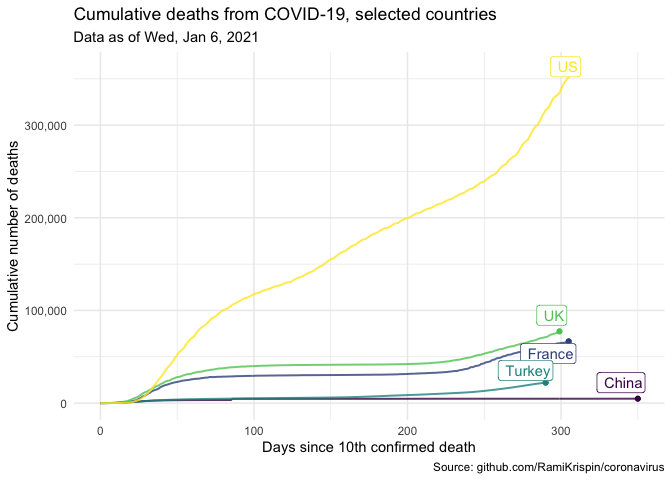

<!-- adapted from https://datasciencebox.org under a CC BY-SA 4.0 licence (https://creativecommons.org/licenses/by-sa/4.0/); original document:  https://github.com/rstudio-education/datascience-box/blob/master/course-materials/application-exercises/ae-01b-covid/covid.Rmd
-->

## Introduction

Countries around the world are responding to an outbreak of respiratory illness caused by a novel coronavirus, COVID-19.
The outbreak first started in Wuhan, China, but cases have been identified in a growing number of other locations internationally, including the United States.
In this report we explore how the trajectory of the cumulative deaths in a number of countries.

The data come from the **coronavirus** package, which pulls data from the Johns Hopkins University Center for Systems Science and Engineering (JHU CCSE) Coronavirus repository.
The coronavirus package provides a tidy format dataset of the 2019 Novel Coronavirus COVID-19 (2019-nCoV) epidemic.
The package is available on GitHub [here](https://github.com/RamiKrispin/coronavirus) and is updated daily.

For our analysis, in addition to the coronavirus package, we will use the following packages for data wrangling and visualisation.

-   **tidyverse** for data wrangling and visualization
-   **lubridate** package for handling dates
-   **glue** package for constructing text strings
-   **scales** package for formatting axis labels
-   **ggrepel** package for pretty printing of country labels

We will make use of the **DT** package for interactive display of tabular output in the Appendix.


```r
library(coronavirus) # devtools::install_github("RamiKrispin/coronavirus")
library(tidyverse)
library(lubridate)
library(glue)
library(scales)
library(ggrepel)
library(DT)
```

## Data prep

The data frame called `coronavirus` in the coronavirus package provides a daily summary of the Coronavirus (COVID-19) cases by country.
Each row in the data frame represents a country (or, where relevant, state/province).
A full list of the countries in the data frame is provided in the [Appendix].
Note that the data provided in this package provides daily number of deaths, confirmed cases, and recovered cases.
For this report, we will focus on the deaths.

Let us first examine the data frame.


```r
head(coronavirus)
```

```
##         date province     country      lat     long      type cases
## 1 2020-01-22          Afghanistan 33.93911 67.70995 confirmed     0
## 2 2020-01-23          Afghanistan 33.93911 67.70995 confirmed     0
## 3 2020-01-24          Afghanistan 33.93911 67.70995 confirmed     0
## 4 2020-01-25          Afghanistan 33.93911 67.70995 confirmed     0
## 5 2020-01-26          Afghanistan 33.93911 67.70995 confirmed     0
## 6 2020-01-27          Afghanistan 33.93911 67.70995 confirmed     0
```


We will start by making our selection for the countries we want to explore.


```r
countries <- c(
  "China",
  "France",
  "United Kingdom",
  "US",
  "Turkey"
)
```

In the following code chunk we filter the data frame for deaths in the countries we specified above and calculate cumulative number of deaths.
We will only visualise data since 10th confirmed death.


```r
country_data <- coronavirus %>%
  # filter for deaths in countries of interest
  filter(
    type == "death",
    country %in% countries
  ) %>%
  # fix county labels for pretty plotting
  mutate(
    country = case_when(
      country == "United Kingdom" ~ "UK",
      TRUE ~ country
    )
  ) %>%
  # calculate number of total cases for each country and date
  group_by(country, date) %>%
  summarise(tot_cases = sum(cases)) %>%
  # arrange by date in ascending order
  arrange(date) %>%
  # record daily cumulative cases as cumulative_cases
  mutate(cumulative_cases = cumsum(tot_cases)) %>%
  # only use days since the 10th confirmed death
  filter(cumulative_cases > 9) %>%
  # record days elapsed, end date, and end label
  mutate(
    days_elapsed = as.numeric(date - min(date)),
    end_date     = if_else(date == max(date), TRUE, FALSE),
    end_label    = if_else(end_date, country, NULL)
  ) %>%
  # ungroup
  ungroup()
```

```
## `summarise()` regrouping output by 'country' (override with `.groups` argument)
```

We also need to take a note of the "as of date" for the data so that we can properly label our visualisation.


```r
as_of_date <- country_data %>% 
  summarise(max(date)) %>% 
  pull()

as_of_date_formatted <- glue("{wday(as_of_date, label = TRUE)}, {month(as_of_date, label = TRUE)} {day(as_of_date)}, {year(as_of_date)}")
```

These data are as of Wed, Jan 6, 2021.

## Visualisation

The following visualisation shows the number of cumulative cases vs. days elapsed since the 10th confirmed death in each country.
The time span plotted for each country varies since some countries started seeing (and reporting) deaths from COVID-19 much later than others.


```r
ggplot(data = country_data,
       mapping = aes(x = days_elapsed, 
                     y = cumulative_cases, 
                     color = country, 
                     label = end_label)) +
  # represent cumulative cases with lines
  geom_line(size = 0.7, alpha = 0.8) +
  # add points to line endings
  geom_point(data = country_data %>% filter(end_date)) +
  # add country labels, nudged above the lines
  geom_label_repel(nudge_y = 1, direction = "y", hjust = 1) + 
  # turn off legend
  guides(color = FALSE) +
  # use pretty colors
  scale_color_viridis_d() +
  # better formatting for y-axis
  scale_y_continuous(labels = label_comma()) +
  # use minimal theme
  theme_minimal() +
  # customize labels
  labs(
    x = "Days since 10th confirmed death",
    y = "Cumulative number of deaths",
    title = "Cumulative deaths from COVID-19, selected countries",
    subtitle = glue("Data as of", as_of_date_formatted, .sep = " "),
    caption = "Source: github.com/RamiKrispin/coronavirus"
  )
```

<!-- -->

## Appendix

A list of countries in the `coronavirus` data frame is provided below.

<!--html_preserve--><div id="htmlwidget-e9a5bc29f2e3c4cfe346" style="width:100%;height:auto;" class="datatables html-widget"></div>
<script type="application/json" data-for="htmlwidget-e9a5bc29f2e3c4cfe346">{"x":{"filter":"none","data":[["1","2","3","4","5","6","7","8","9","10","11","12","13","14","15","16","17","18","19","20","21","22","23","24","25","26","27","28","29","30","31","32","33","34","35","36","37","38","39","40","41","42","43","44","45","46","47","48","49","50","51","52","53","54","55","56","57","58","59","60","61","62","63","64","65","66","67","68","69","70","71","72","73","74","75","76","77","78","79","80","81","82","83","84","85","86","87","88","89","90","91","92","93","94","95","96","97","98","99","100","101","102","103","104","105","106","107","108","109","110","111","112","113","114","115","116","117","118","119","120","121","122","123","124","125","126","127","128","129","130","131","132","133","134","135","136","137","138","139","140","141","142","143","144","145","146","147","148","149","150","151","152","153","154","155","156","157","158","159","160","161","162","163","164","165","166","167","168","169","170","171","172","173","174","175","176","177","178","179","180","181","182","183","184","185","186","187","188","189","190","191"],["Afghanistan","Albania","Algeria","Andorra","Angola","Antigua and Barbuda","Argentina","Armenia","Australia","Austria","Azerbaijan","Bahamas","Bahrain","Bangladesh","Barbados","Belarus","Belgium","Belize","Benin","Bhutan","Bolivia","Bosnia and Herzegovina","Botswana","Brazil","Brunei","Bulgaria","Burkina Faso","Burma","Burundi","Cabo Verde","Cambodia","Cameroon","Canada","Central African Republic","Chad","Chile","China","Colombia","Comoros","Congo (Brazzaville)","Congo (Kinshasa)","Costa Rica","Cote d'Ivoire","Croatia","Cuba","Cyprus","Czechia","Denmark","Diamond Princess","Djibouti","Dominica","Dominican Republic","Ecuador","Egypt","El Salvador","Equatorial Guinea","Eritrea","Estonia","Eswatini","Ethiopia","Fiji","Finland","France","Gabon","Gambia","Georgia","Germany","Ghana","Greece","Grenada","Guatemala","Guinea","Guinea-Bissau","Guyana","Haiti","Holy See","Honduras","Hungary","Iceland","India","Indonesia","Iran","Iraq","Ireland","Israel","Italy","Jamaica","Japan","Jordan","Kazakhstan","Kenya","Korea, South","Kosovo","Kuwait","Kyrgyzstan","Laos","Latvia","Lebanon","Lesotho","Liberia","Libya","Liechtenstein","Lithuania","Luxembourg","Madagascar","Malawi","Malaysia","Maldives","Mali","Malta","Marshall Islands","Mauritania","Mauritius","Mexico","Moldova","Monaco","Mongolia","Montenegro","Morocco","Mozambique","MS Zaandam","Namibia","Nepal","Netherlands","New Zealand","Nicaragua","Niger","Nigeria","North Macedonia","Norway","Oman","Pakistan","Panama","Papua New Guinea","Paraguay","Peru","Philippines","Poland","Portugal","Qatar","Romania","Russia","Rwanda","Saint Kitts and Nevis","Saint Lucia","Saint Vincent and the Grenadines","Samoa","San Marino","Sao Tome and Principe","Saudi Arabia","Senegal","Serbia","Seychelles","Sierra Leone","Singapore","Slovakia","Slovenia","Solomon Islands","Somalia","South Africa","South Sudan","Spain","Sri Lanka","Sudan","Suriname","Sweden","Switzerland","Syria","Taiwan*","Tajikistan","Tanzania","Thailand","Timor-Leste","Togo","Trinidad and Tobago","Tunisia","Turkey","Uganda","Ukraine","United Arab Emirates","United Kingdom","Uruguay","US","Uzbekistan","Vanuatu","Venezuela","Vietnam","West Bank and Gaza","Yemen","Zambia","Zimbabwe"]],"container":"<table class=\"display\">\n  <thead>\n    <tr>\n      <th> <\/th>\n      <th>country<\/th>\n    <\/tr>\n  <\/thead>\n<\/table>","options":{"order":[],"autoWidth":false,"orderClasses":false,"columnDefs":[{"orderable":false,"targets":0}]}},"evals":[],"jsHooks":[]}</script><!--/html_preserve-->
