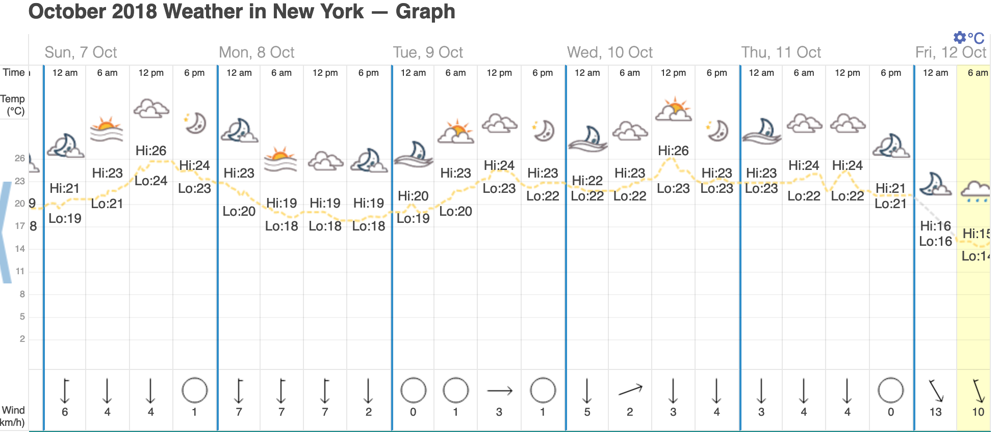

```{r setup, include=FALSE}
knitr::opts_chunk$set(echo = TRUE)

library(tidyverse)
library(skimr)
library(lubridate)
```

## Import data and rename variables  

Import and inspect the data. Note the different options for inspecting the data.

```{r import_data}
squirrels <- read_csv("data/2018_Central_Park_Squirrel_Census_-_Squirrel_Data.csv")

# show the data
# don't forget that you can also use view(squirrels) to do this
squirrels

# glimpse is another option -- it is useful in cases like this, where we have many columns
glimpse(squirrels)

# use the summary function from baseR
summary(squirrels)

# skim from the skimr package provides further details
skim(squirrels)

```

Rename and select variables.

```{r rename_vars}

squirrels <- squirrels %>%
  mutate(Date = mdy(Date)) %>% 
  rename(primary_fur_colour = `Primary Fur Color`,
         hectare = Hectare,
         shift = Shift,
         date = Date,
         age = Age) %>%
  select(hectare, shift, date, age, primary_fur_colour)

```

## Explore the data via visualisation

Start by plotting a histogram to examine the distribution of the data. The histogram automatically produces counts; we thus only need to specify the x-axis in our aesthetics.

```{r histogram}

ggplot(data = squirrels, aes(date)) +
  # for histograms, we need to specify the binwidth as the default values may not be optimal
  # since we have a date argument, 1 = one day
  # note that for a time argument, 1 = one second
  geom_histogram(binwidth = 1)

```

Make the x-axis more informative (see https://ggplot2.tidyverse.org/reference/scale_date.html). For these functions, we need the `scales` package.

```{r histogram2}

ggplot(squirrels, aes(date)) +
  # since we have a date argument, 1 = one day
  # note that for a time argument, 1 = one second
  geom_histogram(binwidth = 1) +
  scale_x_date(date_breaks = "days" , date_labels = "%d-%b")

```

For an alternative using lines, we can use a frequency polygon (`geom_freqpoly`).

```{r frequency_polygon}

ggplot(squirrels, aes(date)) +
  geom_freqpoly(binwidth = 1) +
  scale_x_date(date_breaks = "days" , date_labels = "%d-%b")

```

Let's simplify the x-axis given that the month is redundant. At the same time, we can add a few other details to make the plot more self-explanatory.

```{r frequency_polygon2}

ggplot(squirrels, aes(date)) +
  geom_freqpoly(binwidth = 1) +
  scale_x_date(date_breaks = "days" , date_labels = "%d") +
  xlab("Day - October 2018") +
  ylab ("Number of squirrels counted") +
  ggtitle("Central Park squirrel census", subtitle = "Counts per day")

```


The frequency polygon allows us to start looking at additional variables such as time of sighting (am/pm) ...

```{r frequency_polygon_tod}

ggplot(squirrels, aes(date)) +
  geom_freqpoly(aes(colour = shift), binwidth = 1) +
  scale_x_date(date_breaks = "days" , date_labels = "%d") +
  xlab("Day - October 2018") +
  ylab ("Number of squirrels counted") +
  ggtitle("Central Park squirrel census", subtitle = "Counts per day and time of day")

```

... or age.

```{r frequency_polygon_age}

ggplot(squirrels, aes(date)) +
  geom_freqpoly(aes(colour = age), binwidth = 1) +
  scale_x_date(date_breaks = "days" , date_labels = "%d") +
  xlab("Day - October 2018") +
  ylab ("Number of squirrels counted") +
  ggtitle("Central Park squirrel census", subtitle = "Counts per day and age of squirrel")

```

## Why no sightings on certain days?

It seems odd that there are some days without any sightings at all. Could it be the case that the volunteers didn't go out on certain days? Let's add day of the week to see if this sheds any light. [This](https://www.rdocumentation.org/packages/base/versions/3.6.2/topics/strptime) is a useful website for how we can specify the axis labels with a date object. (*Note also the syntax for embedding a link to a website in RMarkdown!*) Since month is redundant here anyway, we can drop that easily.

```{r day_of_the_week}

ggplot(squirrels, aes(date)) +
  # since we have a date argument, 1 = one day
  # note that for a time argument, 1 = one second
  geom_freqpoly(binwidth = 1) +
  scale_x_date(date_breaks = "days" , date_labels = "%a-%d")

```

According to this plot, the intermediary counts of 0 occurred on a Tuesday, Thursday, Monday and Tuesday. This seems to render an explanation of volunteers not working a bit less likely.

It also doesn't seem to be a weather issue as checking weather records from NYC for Oct 2018 (recorded in Central Park!) reveals. Here is a screenshot from [this website](https://www.timeanddate.com/weather/usa/new-york/historic?month=10&year=2018):



*Note how easy it is to insert an image into an RMarkdown document. The syntax is very similar to that for inserting a link -- simply add an exclamation mark!*

## Dealing with missing data

Looking at age revealed some missing data. How we deal with missing values depends on what we want to look at. In our case, we probably at least want to get rid of the "?" for age, since it is not clear what it means in comparison to a missing value ("NA").

To have a look at how many observations have age as ?, we can use `table`. This function is generally useful for counting observations. Note the different usage options.

```{r table1}

table(squirrels$age == "?")

table(squirrels$age)

```

`table` can also be used to count missing values (coded as "NA" in R).

```{r table2}

table(is.na(squirrels$age))

```

We can use `filter` to limit our data to only the observations we want to keep. Note this new use of `filter` for cleaning rather than subsetting data.

```{r filter_to_clean}

squirrels_cleaned <- squirrels %>%
  filter(age %in% c(NA, "Adult", "Juvenile"))

```

Let's look at how this affects our data. Applying the `unique` function to a column yields the unique values in that column. This is very useful for examining which values are present.

```{r examine_cleaned_data}

unique(squirrels$age)
unique(squirrels_cleaned$age)

```


### Excursus: the `c` function

What does `c` mean here? `c` is a function which combines elements to form a vector. It can be applied to all sorts of different objects.

```{r the_c_function}

c("a","b","c")
alphabet <- c("a","b","c")
alphabet

c(alphabet,alphabet)
```


## Exercises -- part 1

**Exercise 1**. Plot how many squirrels of "Cinnamon" colour were sighted during each AM and PM shift

```{r exercise1}

```

**Exercise 2**. Facet the plot by squirrel age

```{r exercise2}

```


## Summary statistics using counts

We can use `n` to count the number of observations.

```{r counts}

# number of squirrels per shift
squirrels %>%
  group_by(shift) %>%
  summarise(n = n())

# more convenient shorthand
squirrels %>%
  group_by(shift) %>%
  tally()

# and more convenient still
# count combines group_by and tally
squirrels %>%
  count(shift)

```

## Exercises -- part 2

**Exercise 3**. Plot the number of black squirrels sighted each day.

```{r exercise3}

```

## Boxplots

Finally, let's summarise the data using box-and-whiskers plots. Can you recall what a boxplot shows?

First, we need a data set with counts. We choose to group these by a number of variables. `na.omit` eliminates missing values.

```{r count_by_age_and_colour}

squirrels_age_colour <- squirrels_cleaned %>%
  count(shift,age,primary_fur_colour,date) %>%
  na.omit()

```

Summarise using boxplots:

```{r boxplots}

ggplot(squirrels_age_colour, aes(x = age, y = n)) +
  geom_boxplot(aes(colour = primary_fur_colour)) +
  facet_wrap(~ shift)

```

## Exercises -- part 3

**Exercise 4**. The variables `Approaches`, `Indifferent` and `Runs from` describe how the observed squirrels interacted with humans. (Note that you will need to go back to the original data set to access these variables!)

a. What are the possible values for these variables?
b. How many squirrels were observed displaying each of the the three behaviours?
c. Does squirrel behaviour differ depending on age or shift? Create boxplots to examine this question. (This one is a challenge!)


