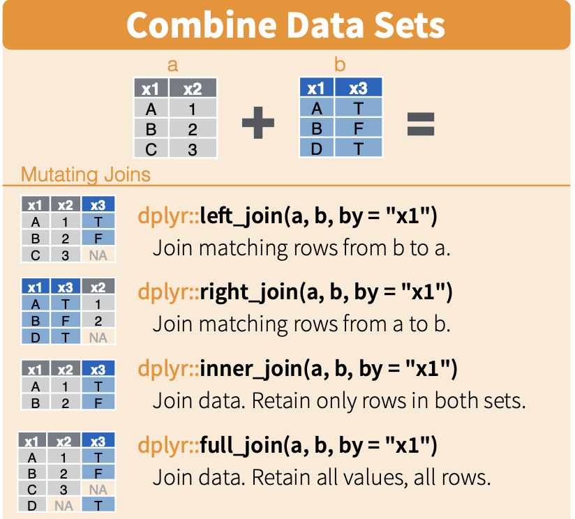
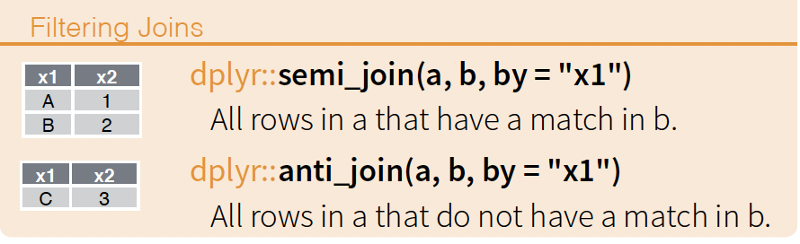

```{r setup, include=FALSE}
knitr::opts_chunk$set(echo = TRUE)
library(tidyverse)
```

## Joins

Joins provide a way of combining multiple data sets (data frames).
The following diagram from the [RStudio Data Wrangling Cheatsheet](https://rstudio.com/wp-content/uploads/2015/02/data-wrangling-cheatsheet.pdf) illustrates the basic properties of different types of joins.



### Mutating joins

We begin by looking at mutating joins, which are the ones that you will probably use most commonly in the types of analysis pipelines we employ.

Let's first create two data frames that are similar to the schematic above.
Assume that `class_a` and `class_b` contain grades for different classes, say "Intro to Python" and "Intro to R".
In each case, the first column includes student names (or other identifiers), while the second column includes grades for the course.

```{r set_up_data}

class_a <- tribble(
  ~student, ~python_grade,
  "Tim", "D",
  "Andrea", "HD",
  "Sally", "C"
)

class_b <- tribble(
  ~student, ~r_grade,
  "Tim", "P1",
  "Andrea", "HD",
  "Ben", "P1"
)

```

How we join the two data frames (i.e. which joining function from `dplyr` we use) depends on what we want to do.
In all cases, we need an overlapping column or columns on which to join the data frames.
This will often be some sort of "ID" variable.
By default, R will join on any columns with overlapping names.

In the following, the terminology assumes that we have a *left* and a *right* data frame.
This refers to the order in which they are passed to the join function.

#### Left join

A left join keeps all the rows of the left data frame and joins matching rows from the right data frame.

```{r left_join}

new_df_left <- left_join(class_a,class_b)
new_df_left

```

#### Right join

A right join, as the name suggests, is the opposite of a left join: it keeps all the rows of the right data frame and joins matching rows from the left data frame.

```{r right_join}

new_df_right <- right_join(class_a,class_b)
new_df_right

```

#### Inner join

An inner join retains only matching rows that appear in both data frames.

```{r inner_join}

new_df_inner <- inner_join(class_a,class_b)
new_df_inner

```

#### Full join

A full join retains all rows from both data frames, inserting NAs (i.e. missing values) where necessary.
Note that this type of join is sometimes called an outer join -- this terminology is used by `pd.merge()` in Python, for example.

```{r full_join}

new_df_full <- full_join(class_a,class_b)
new_df_full

```

#### Additional parameters

To join two data frames where columns have non-overlapping names for the ID variable, use the `by` argument.

```{r join_different_names}

class_a <- tribble(
  ~student, ~python_grade,
  "Tim", "D",
  "Andrea", "HD",
  "Sally", "C"
)

class_b <- tribble(
  ~client, ~r_grade,
  "Tim", "P1",
  "Andrea", "HD",
  "Ben", "P1"
)

left_join(class_a, class_b, by = c("student" = "client"))

```

If you need to distinguish between columns with identical names, use the `suffix` argument.
By default, R will add *.x* and *.y* but more expressive names are often useful.

```{r join_with_suffixes}

class_a <- tribble(
  ~student, ~grade,
  "Tim", "D",
  "Andrea", "HD",
  "Sally", "C"
)

class_b <- tribble(
  ~student, ~grade,
  "Tim", "P1",
  "Andrea", "HD",
  "Ben", "P1"
)

full_join(class_a, class_b, by = "student")

```

```{r join_with_suffixes2}

full_join(class_a, class_b, by = "student", suffix = c("_p","_r"))

```

### Filtering joins

Filtering joins can be used to filter one data frame by the contents of another.
Again, the RStudio Cheatsheet has a useful schematic.



```{r set_up_data2}

class_a <- tribble(
  ~student, ~python_grade,
  "Tim", "D",
  "Andrea", "HD",
  "Sally", "C"
)

class_b <- tribble(
  ~student, ~r_grade,
  "Tim", "P1",
  "Andrea", "HD",
  "Ben", "P1"
)

```


#### Semi-join

Keep only the rows of A that have a match in B.
For example, we might want to see the Python grades for all students in our R class.

```{r semi_join}

semi_join(class_a,class_b)

```

#### Anti-join

The opposite of a semi-join: keep only the rows of A that don't have a match in B.
For example, we might want to see the Python grades for all students who aren't also taking an R class.

```{r anti_join}

anti_join(class_a,class_b)

```
