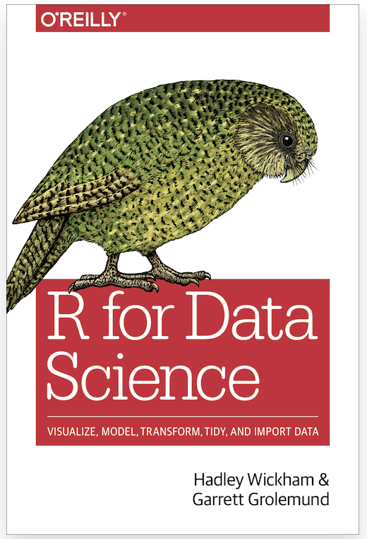
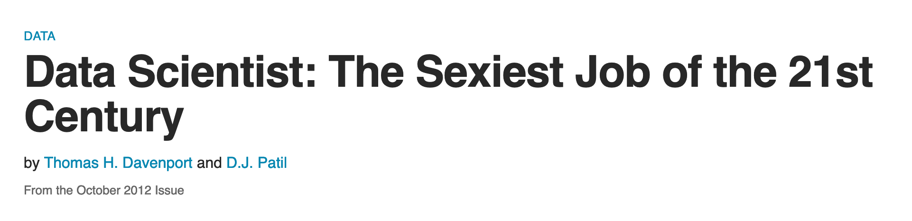
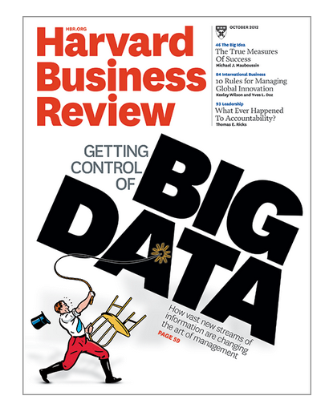
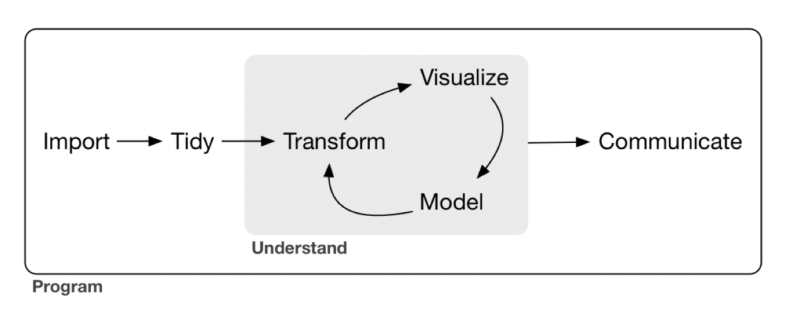

class: inverse, mline, center, middle

# What is Data Science?

---

# What is Data Science?

.pull-left[

<br>
> Data science is an exciting discipline that allows you to turn raw data into understanding, insight, and knowledge. 

<br>

.font70[
Wickham, H. & Grolemund, G. (2017) R for Data Science: Import, Tidy, Transform, Visualize, and Model Data. O'Reilly Media.
Henceforth: *R4DS*
]

freely available at https://r4ds.had.co.nz
]

.pull-right[
```{r echo=FALSE, out.width="85%", fig.align="right"}

```
]

---

# What is Data Science?

```{r echo=FALSE, out.width="60%", fig.align="left"}
knitr::include_graphics("images/Data_scientist_Venn_diagram.png")
```

.pull-right[
  .font60[
  StackExchange Data Science user Stephan Kolassa [CC BY-SA 4.0](https://creativecommons.org/licenses/by-sa/4.0) via [Wikimedia Commons](https://commons.wikimedia.org/wiki/File:Data_scientist_Venn_diagram.png)
  ]
]
---

# What is Data Science?

.pull-left[

### The "sexy new job"

  .font80[
> 'Hal Varian, the chief economist at Google, is known to have said, “The sexy job in the next 10 years will be statisticians.
People think I’m joking, but who would’ve guessed that computer engineers would’ve been the sexy job of the 1990s?”'

<br>

> 'If “sexy” means having rare qualities that are much in demand, data scientists are already there.
They are difficult and expensive to hire and, given the very competitive market for their services, difficult to retain.
There simply aren’t a lot of people with their combination of scientific background and computational and analytical skills.'
  ]
]

```{r echo=FALSE, out.width="50%", fig.align="right"}

```

```{r echo=FALSE, out.width="40%", fig.align="right"}

```

---

# Data Science ...

##  ... why do we need it for cognitive neuroscience and psychology?

<br>

.font150[
Quite simply, because we're also interested in turning "raw data into understanding, insight, and knowledge", as well as in communicating our results!
]
---

# What you will learn in this course

<br>

* how to gain insights from data using contemporary computational tools
* basic programming skills in an open source programming language (i.e. R)
* how to produce reproducible reports (good for science and good for you!)
* how to use online repositories such as GitHub or the Open Science Framework to share data and code

You will also develop an understanding of how these tools help to foster open science, reproducible research and thus the ethical treatment of data.

While critical for research in cognitive (neuro-)science, the data science skills acquired in this course generalise readily to other domains (think sexy jobs!)

---

# So is this just another stats course ...

.pull-left[
  .font150[
  Apart from the fact that we're using R?
  ]
]

-- 

.pull-right[

  
  
  .font60[
  "Oh no you didn't" gif by *happydog* from https://giphy.com
  ]
]

---

# Not just another stats course


### Our focus will be on

* understanding data rather than statistical tests per se (though they will come up)
* philosophy / workflow rather than "results"
* (moral of the story: it's not just about statistical significance!)

### You will be introduced to a set of tools and workflow that

* foster good practices in dealing with data (i.e. we try to draw the best insights we can from a dataset)
* foster open science (i.e. we share our data and "show our work", which is good for science and for sharing knowledge)
* are economical and reproducible (i.e. we avoid doing stuff by hand)

---

# Speaking of workflow

<br>

```{r echo=FALSE, out.width="100%"}

```

.font80[
  from *R4DS*
]

---

# Speaking of workflow


.pull-left[

```{r echo=FALSE, out.width="100%", fig.align="left"}

```

* **import** data (into R)
* **tidy** data
  - bring it into a consistent format that can be used for multiple purposes (each column = variable; each row = observation)
  - lets you focus on understanding the data rather than which format you need

]

.pull-right[

<br>

* **transform** data
  * e.g. focus on observations of interest (such as those from a particular location), create new variables (such as speed from distance and time), compute summary statistics
* **visualise** data
  * essential for understanding
* **model** data
  * use (statistical) models to answer your questions about the data
* **communicate** insights
]
