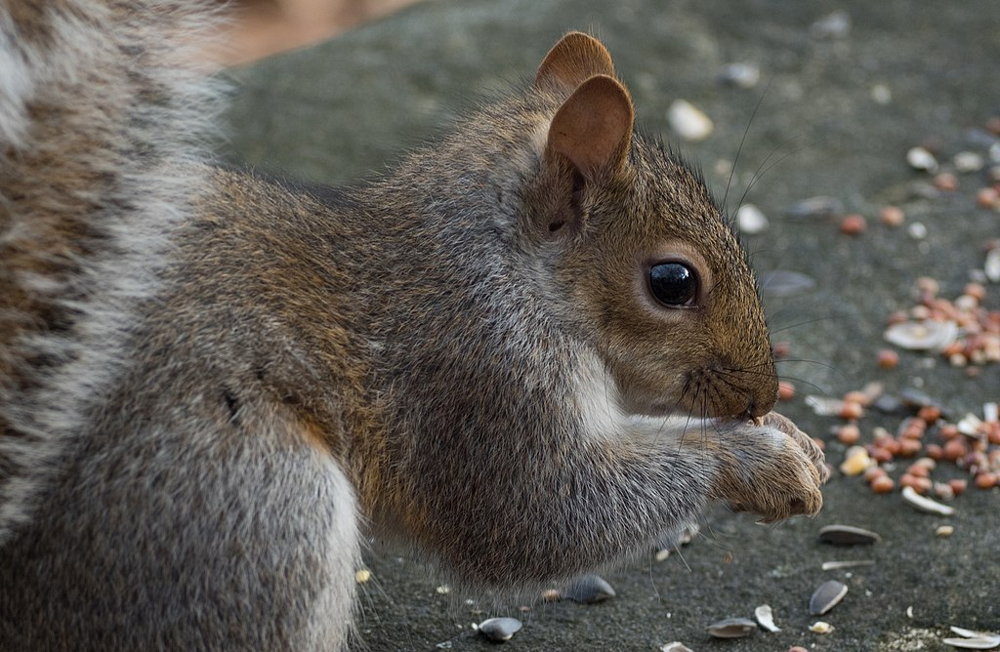
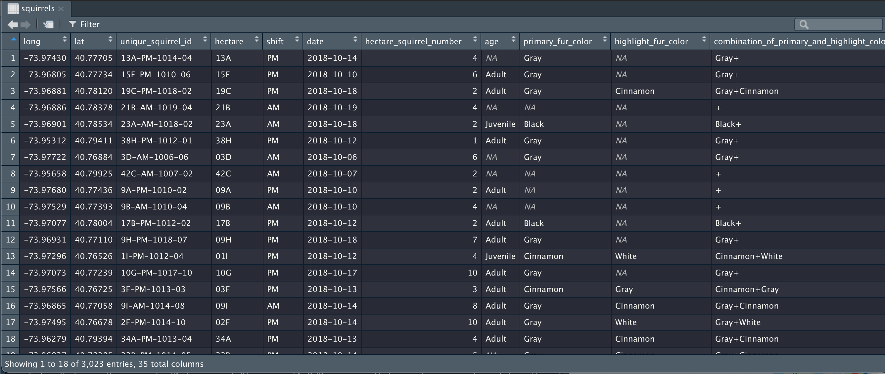
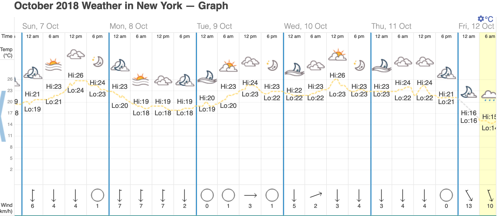

```{r packages, echo=FALSE, message=FALSE, warning=FALSE}
library(tidyverse)
library(emo) # devtools::install_github("hadley/emo")
library(nycsquirrels18) #devtools::install_github("mine-cetinkaya-rundel/nycsquirrels18")

```

# An Adelaidian in New York ...

.pull-left[

Imagine the following scenario: you are excited to be embarking on your first trip to New York and one of the highlights that you are particularly looking forward to is visiting Central Park.

```{r echo=FALSE, out.width="80%", fig.align="left"}

```

.font60[
Central Park in May 2019. Source: IBS

<br>

Map from GoogleMaps
]

]

.pull-right[
```{r echo=FALSE, out.width="75%", fig.align="right"}

```

]

---

# ... in search of squirrels!

.pull-left[

In addition to its spectacular scenery, Central Park has interesting wildlife, notably Eastern Grey squirrels. 

```{r echo=FALSE, out.width="80%", fig.align="left"}

```

.font60[
Source: Rhododendrites [CC BY-SA 4.0](https://creativecommons.org/licenses/by-sa/4.0)
via [Wikimedia Commons](https://commons.wikimedia.org/wiki/File:Squirrel_in_Central_Park_10100.jpg)
]

]

.pull-right[

Now, however, you face the following dilemma: your itinerary is so full, that you will probably only be able to visit Central Park once.
How can you best plan your visit so that you will be most likely to see squirrels?

Luckily, you come across data from the [Central Park Squirrel Census](https://www.thesquirrelcensus.com/)!

]

---

# The Central Park Squirrel Census

<br>

- In October 2018, the Central Park Squirrel Census counted the squirrels in Central Park "with the help of 323 volunteer Squirrel Sighters".
- The data are publicly available via [NYC Open Data](https://data.cityofnewyork.us/Environment/2018-Central-Park-Squirrel-Census-Squirrel-Data/vfnx-vebw).
- Conveniently, they have also been made available as an R package (more on what this means later) by Dr Mine Çetinkaya-Rundel, who is a Senior Lecturer at the University of Edinburgh and a Professional Educator and Data Scientist at RStudio.
- The package can be installed from [a github repository](https://github.com/mine-cetinkaya-rundel/nycsquirrels18) -- again, you will learn more about what github is and why it is useful later on in this course.

***

We can load this package into R using the following code: 

```{r}
library(nycsquirrels18)
```

<small>
(Note: I don't expect you to fully understand the code at this point.
I am merely presenting it so that you can start to get a feel for what R code looks like.
I will walk you through each step in detail later.)
</small>

---

# What's in the data?

The `nycsquirrels18` package contains the squirrel census data set (called `squirrels`).

<br>

```{r echo = FALSE, out.width="100%"}
# Show the data 
# head(squirrels)

```

---

# What's in the data?

<br>

```{r}
# Get help by viewing the R documentation -- in this case, information about the variables in the dataset
# Note that this doesn't produce any output in the html document
# It will, however, show up in RStudio if you run this command in the console
?squirrels
```

***

From this initial exploration, we can see that the data frame contains 35 variables and 3023 observations.

We will start exploring the data by looking at the following five variables (descriptions on the next slide are taken from the R documentation):

---

# Variables of interest

<br>

- **hectare**: ID tag, which is derived from the hectare grid used to divide and count the park area. One axis that runs predominantly north-to-south is numerical (1-42), and the axis that runs predominantly east-to-west is roman characters (A-I).
- **shift**: Value is either "AM" or "PM," to communicate whether or not the sighting session occurred in the morning or late afternoon.
- **date**: Concatenation of the sighting session day and month.
- **age**: Value is either "Adult" or "Juvenile."
- **primary_fur_color**: Value is either "Gray," "Cinnamon" or "Black."

---

# A first look at the data

```{r echo=FALSE, message=FALSE, cache=FALSE, dpi=300, out.width="70%"}
library(tidyverse)
library(scales)
squirrels %>%
  ggplot(aes(date)) +
  # since we have a date argument, 1 = one day
  # note that for a time argument, 1 = one second
  geom_histogram(binwidth = 1, fill = "#b3e2cd", alpha = 0.9) +
  scale_x_date(date_breaks = "days" , date_labels = "%d") +
  xlab("Day - October 2018") +
  ylab ("Number of squirrels counted") +
  ggtitle("Central Park squirrel census", subtitle = "Counts per day") +
  theme_minimal() +
  theme(axis.text=element_text(size=14),
        axis.title=element_text(size=16),
        title=element_text(size=18))

```

---

# An alternative using lines

```{r, echo=FALSE, cache=FALSE, out.width="70%", dpi=300}
library(tidyverse)
library(scales)
squirrels %>%
  ggplot(aes(date)) +
  # since we have a date argument, 1 = one day
  # note that for a time argument, 1 = one second
  geom_freqpoly(binwidth = 1, col = "#b3e2cd", size = 1.5) +
  scale_x_date(date_breaks = "days" , date_labels = "%d") +
  xlab("Day - October 2018") +
  ylab ("Number of squirrels counted") +
  ggtitle("Central Park squirrel census", subtitle = "Counts per day") +
  theme_minimal() +
  theme(axis.text=element_text(size=14),
        axis.title=element_text(size=16),
        title=element_text(size=18)) +
  scale_colour_brewer(palette = "Pastel2")

```

---

# Let's look at additional variables

.pull-left[
* e.g. sighting (am/pm)
* recall that this is coded in the variable "shift" 

This graph already gives us some idea that squirrels can generally be seen in both the morning and late afternoon.

Good news for our itinerary, since it means that we could slot in a visit either in the morning or the afternoon!

.font80[
(While on some days, more squirrels were sighted during the pm shift, we would probably want to see data from a longer time period to confirm that this is indeeed a systematic pattern.)
]
]

.pull-right[
```{r, echo=FALSE, cache=FALSE, out.width="100%", dpi=300}
squirrels %>%
  ggplot(aes(date)) +
  geom_freqpoly(aes(colour = shift), binwidth = 1, size = 1.5) +
  scale_x_date(date_breaks = "days" , date_labels = "%d") +
  xlab("Day - October 2018") +
  ylab ("Number of squirrels counted") +
  ggtitle("Central Park squirrel census", subtitle = "Counts per day and time of day") +
  theme_minimal() +
    theme(axis.text=element_text(size=14),
        axis.title=element_text(size=16),
        legend.text=element_text(size=16),
        title=element_text(size=18)) +
  scale_colour_brewer(palette = "Pastel2")

```
]

---

# Exploration also revealed ...

<br>

* more details on the time frame during which the data were collected (Oct 6--20)
* why there is such a high degree of fluctuation across days - some with 0 sightings and some with over 400?
* should lead us to examine the data set further
* e.g. did the volunteers only go out on certain days?
* or were there indeed days with over 300 volunteers in the park and no sightings at all?
* (or did the number of volunteers vary from day to day?)

---

# Sightings per day - follow-up I

<br>

.pull-left[
* why no sightings on certain days?
* let's add day of the week to see if this can shed any light on what's going on

.font80[
Note that we can let R look this information up for us -- no need to add it manually.
]

* the intermediary counts of 0 occurred on a Tuesday, Thursday, Monday and Tuesday
* no clear pattern
]

.pull-right[

```{r, echo=FALSE, cache=FALSE, out.width="100%", dpi=300}
squirrels %>%
  ggplot(aes(date)) +
  # since we have a date argument, 1 = one day
  # note that for a time argument, 1 = one second
  geom_freqpoly(binwidth = 1, col = "#b3e2cd", size = 1.5) +
  scale_x_date(date_breaks = "days" , date_labels = "%a") +
  xlab("Day - October 2018") +
  ylab ("Number of squirrels counted") +
  ggtitle("Central Park squirrel census", subtitle = "Counts per day") +
  theme_minimal() +
  theme(axis.text=element_text(size=12),
        axis.title=element_text(size=16),
        title=element_text(size=18))

```

]

---

# Sightings per day - follow-up II

* weather patterns also don't provide an explanation, as revealed by NYC weather records from October 2018

.font80[
Alas, I had to look these up manually via [this website](https://www.timeanddate.com/weather/usa/new-york/historic?month=10&year=2018)!
]


```{r echo = FALSE, out.width="100%"}

```

---

# Where am I most likely to see a squirrel?

.pull-left[
* for a first look, we can look at the number of sightings per hectare
* we first summarise counts per hectare

```{r, echo=FALSE, cache=FALSE, out.width="100%", dpi=300}
squirrels_per_hectare <- squirrels %>%
  count(hectare)
```
]

.pull-right[
```{r, echo=FALSE, cache=FALSE, out.width="100%", dpi=300}

squirrels_per_hectare

```
]

---

# Where am I most likely to see a squirrel?

```{r, echo=FALSE, cache=FALSE, out.width="70%", dpi=300}
squirrels_per_hectare %>%
  ggplot(aes(x = hectare, y = n)) +
  geom_point() +
  xlab("Hectare") +
  ylab ("Number of squirrels counted") +
  ggtitle("Central Park squirrel census", subtitle = "Counts per hectare") +
  theme_minimal()
```

---

# A more informative version

.pull-left[
* counts per hectare are not very informative (339 hectares!)
* let's divide these into the two grid dimensions:
  * N-S: 1-42
  * E-W: A-I
]

.pull-right[
```{r, echo=FALSE, cache=FALSE, out.width="100%", dpi=300}
squirrels_per_hectare_grid <- squirrels_per_hectare %>%
  mutate(NS = substr(hectare,1,2),
         EW = substr(hectare,3,3))

squirrels_per_hectare_grid
```
]

---

# Squirrel hotspots!

```{r, echo=FALSE, cache=FALSE, out.width="150%", dpi=300}

squirrels_per_hectare_grid %>%
  ggplot(aes(x = NS, y = fct_rev(EW))) +
  geom_tile(aes(fill = n)) +
  ylab("East-West") +
  xlab ("North-South") +
  ggtitle("Central Park squirrel census", subtitle = "Counts per hectare") +
  theme_minimal() +
  scale_fill_distiller(palette = "Spectral") +
  coord_fixed(ratio = 1)

```

