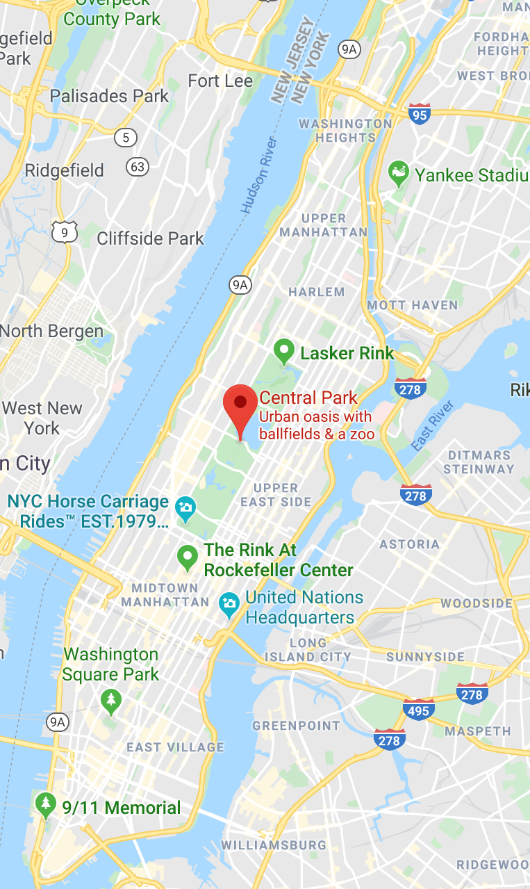

```{r packages, echo=FALSE, message=FALSE, warning=FALSE}
library(tidyverse)
library(emo)
library(nycsquirrels18) #devtools::install_github("mine-cetinkaya-rundel/nycsquirrels18")

```

# An Adelaidian in New York ...

.pull-left[

Imagine the following scenario: you are excited to be embarking on your first trip to New York and one of the highlights that you are particularly looking forward to is visiting Central Park.

```{r echo=FALSE, out.width="80%", fig.align="left"}

```

.font60[
Central Park in May 2019. Source: IBS

<br>

Map from GoogleMaps
]

]

.pull-right[
```{r echo=FALSE, out.width="75%", fig.align="right"}

```

]

---

# ... in search of squirrels!

.pull-left[

In addition to its spectacular scenery, Central Park has interesting wildlife, notably Eastern Grey squirrels. 

```{r echo=FALSE, out.width="80%", fig.align="left"}

```

.font60[
Source: Rhododendrites [CC BY-SA 4.0](https://creativecommons.org/licenses/by-sa/4.0)
via [Wikimedia Commons](https://commons.wikimedia.org/wiki/File:Squirrel_in_Central_Park_10100.jpg)
]

]

.pull-right[

Now, however, you face the following dilemma: your itinerary is so full, that you will probably only be able to visit Central Park once.
How can you best plan your visit so that you will be most likely to see squirrels?

Luckily, you come across data from the [Central Park Squirrel Census](https://www.thesquirrelcensus.com/)!

]

---

# The Central Park Squirrel Census

<br>

- In October 2018, the Central Park Squirrel Census counted the squirrels in Central Park "with the help of 323 volunteer Squirrel Sighters".
- The data are publicly available via [NYC Open Data](https://data.cityofnewyork.us/Environment/2018-Central-Park-Squirrel-Census-Squirrel-Data/vfnx-vebw).
- Conveniently, they have also been made available as an R package (more on what this means later) by Dr Mine Çetinkaya-Rundel, who is an Associate Professor in the Department of Statistical Science at Duke University and a Professional Educator and Data Scientist at RStudio.
- The package can be installed from [a github repository](https://github.com/mine-cetinkaya-rundel/nycsquirrels18) -- again, you will learn more about what github is and why it is useful later on in this course.

***

We can load this package into R using the following code: 

```{r}
library(nycsquirrels18)
```

<small>
(Note: I don't expect you to fully understand the code at this point.
I am merely presenting it so that you can start to get a feel for what R code looks like.
I will walk you through each step in detail later.)
</small>

---

# What's in the data?

The `nycsquirrels18` package contains the squirrel census dataset (called `squirrels`).

```{r echo = FALSE, out.width="50%"}
# Show the data 
head(squirrels)
```

