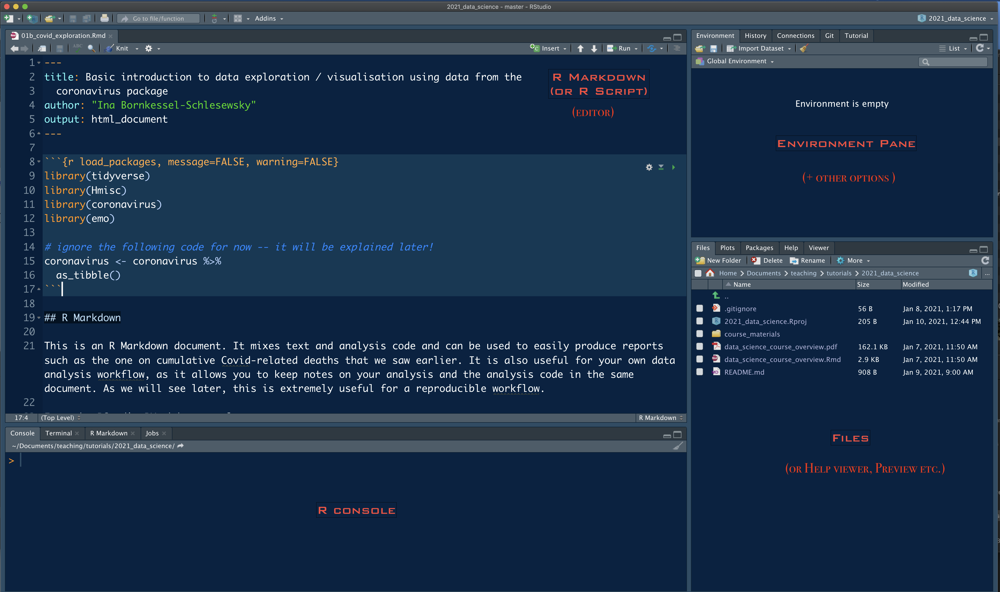

```{r packages, echo=FALSE, message=FALSE, warning=FALSE}
library(tidyverse)
library(emo)
library(coronavirus)
```

class: inverse, mline, center, middle

# Data exploration and visualisation: first steps

---

# Reproducibility checklist

<br>

### What does it mean for a data analysis to be "reproducible"?

* Are the tables, figures (and any other results reported) reproducible from the code and data?
* Does the code actually do what you think it does?
* In addition to what was done, is it clear *why* it was done?

### Reproducibility toolkit

- Scriptability $\rightarrow$ R
- Literate programming (code, narrative, output in one place) $\rightarrow$ R Markdown
- Version control $\rightarrow$ Git / GitHub (**more on this later**)

.font90[
Adapted from https://github.com/rstudio-education/datascience-box/blob/master/course-materials/slides/u1-d02-toolkit-r/u1-d02-toolkit-r.Rmd
]

---
# A bit more on R and RStudio

```{r echo=FALSE, out.width="100%"}

```