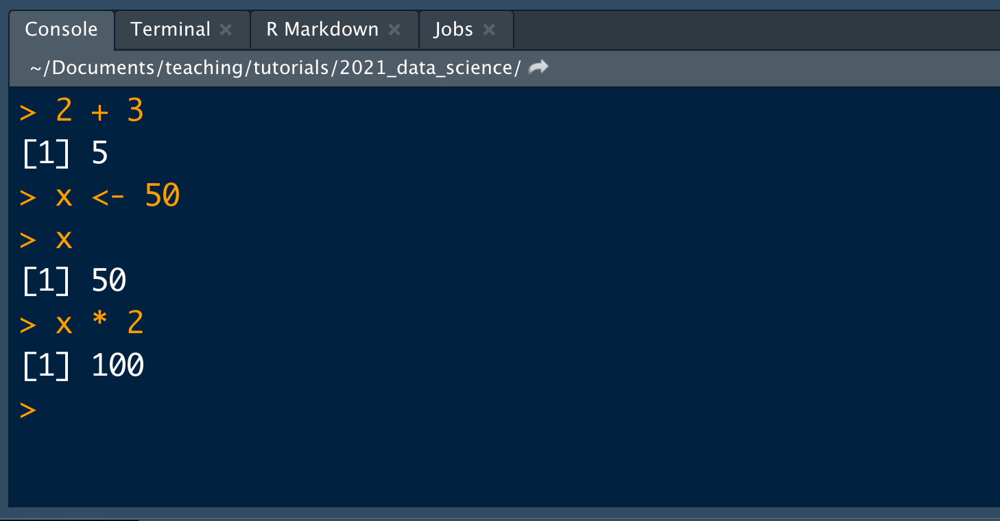
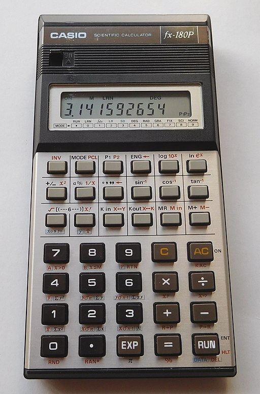
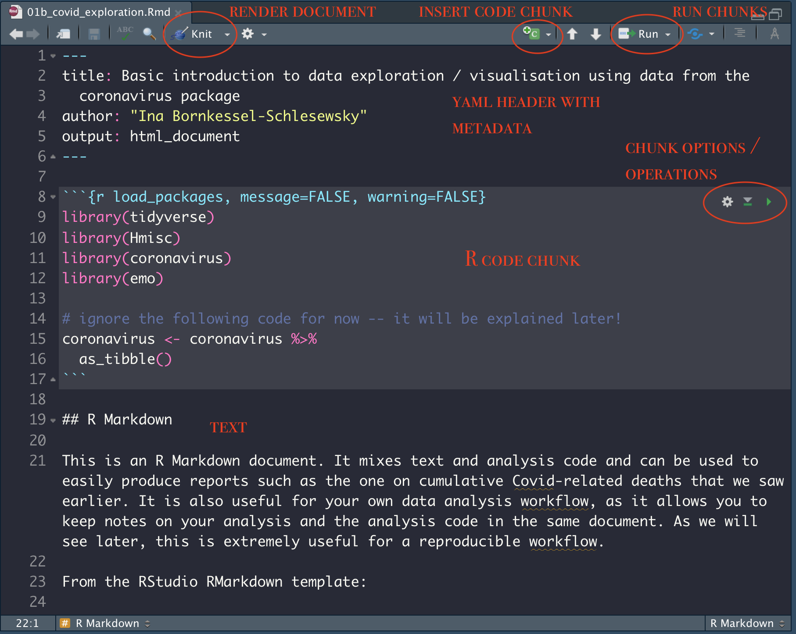
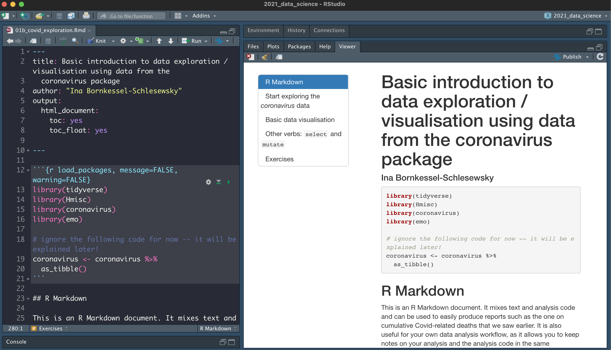

```{r packages, echo=FALSE, message=FALSE, warning=FALSE}
library(tidyverse)
library(emo)
library(coronavirus)
```

class: inverse, mline, center, middle

# Data exploration and visualisation: first steps

---

# Reproducibility checklist

<br>

### What does it mean for a data analysis to be "reproducible"?

* Are the tables, figures (and any other results reported) reproducible from the code and data?
* Does the code actually do what you think it does?
* In addition to what was done, is it clear *why* it was done?

### Reproducibility toolkit

- Scriptability $\rightarrow$ R
- Literate programming (code, narrative, output in one place) $\rightarrow$ R Markdown
- Version control $\rightarrow$ Git / GitHub (**more on this later**)

.font90[
Adapted from https://github.com/rstudio-education/datascience-box/blob/master/course-materials/slides/u1-d02-toolkit-r/u1-d02-toolkit-r.Rmd
]

---
# A bit more on R and RStudio

```{r echo=FALSE, out.width="100%"}
knitr::include_graphics("images/rstudio.png")
```

---
# R console

.pull-left[
* this is where the "magic happens", i.e. where the calculations take place
* think of a calculator on steroids `r emo::ji("joy")`
* we can interact with the console directly (see example)
* mostly, however, we will be working with scripted input

```{r echo=FALSE, out.width="80%"}

```

]

.pull-right[

```{r echo=FALSE, out.width="70%"}

```
.font60[
Cjp24 [CC BY-SA 4.0](https://creativecommons.org/licenses/by-sa/4.0), via Wikimedia Commons
]
]

---

# Scripted R code

.pull-left[
* An R "script" is simply a text file with a collection of R commands
* Think of it as a set of instructions that you can feed into your "calculator"
* This is an important step towards reproducibility, as it means that you have a record of your analysis and you can recreate it at any time
]

.pull-right[

```{r echo=FALSE, out.width="100%"}
knitr::include_graphics("images/rscript.png")
```

]

---

# RMarkdown

<br>

* Mixes text (formatted using Markdown) and R code
* Allows for documentation of analysis steps (the "why"): the next step towards reproducibility
* Easily generate reproducible reports in different formats (.html, .pdf, .docx)
* You can even use RMarkdown to create slides for presentations (these slides are written in RMarkdown!), interactive tutorials (such as the one you will use for revision later) and interactive web applications

---

# RMarkdown

```{r echo=FALSE, out.width="90%"}

```

---

# RMarkdown rendered document

```{r echo=FALSE, out.width="90%"}

```

---

class: inverse, mline, center, middle

# Your turn: let's explore the *coronavirus* data with the help of an RMarkkdown document!
