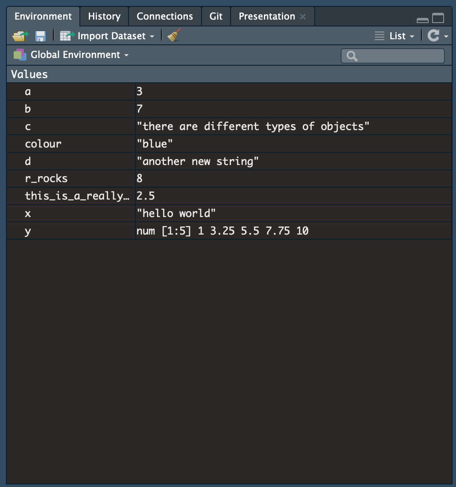
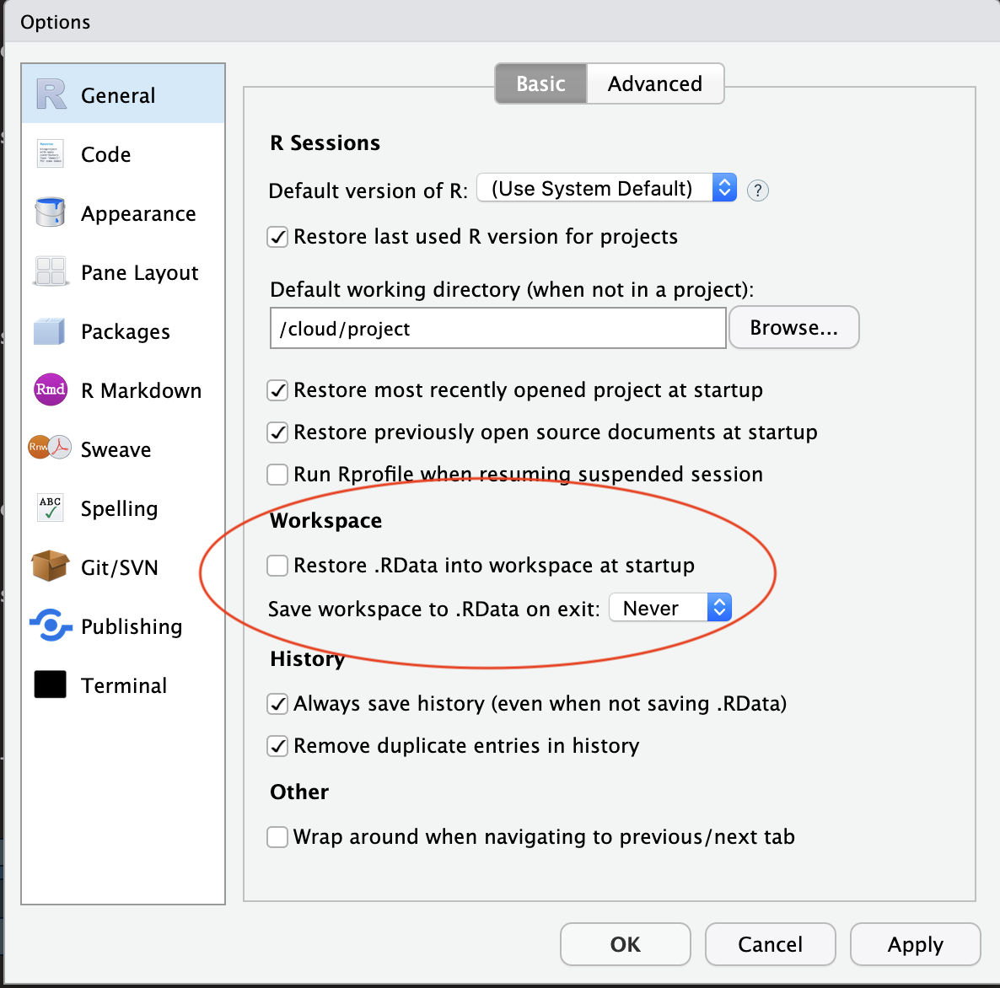

```{r packages, echo=FALSE, message=FALSE, warning=FALSE}
library(tidyverse)
library(emo)
library(gapminder)
```

---

# Let's get to know R a little better!

<br>

* R programming basics
* R workflow basics
* Importing data (they don't always come as an R-package!)
* Tidying data
* More on data exploration and data wrangling

---

class: inverse, mline, center, middle

# R programming basics

The following closely mirrors R4DS chapter 2 (section 4 in the online version of the book)
---

# Using R as a calculator

```{r calculator}
3+4

1 / 200 *30

sin(pi / 2)

sqrt(16)

```

Try out a few calculations in your RStudio console!

---

# Creating new objects

.pull-left[
* Recall the assignment operator `<-`
* We can use this to create new objects using the general schema:

> `object_name <- value` 

* RStudio shortcut: Alt + - (i.e. the minus sign) 
* Type an object's name to inspect it
* Or enclose the assignment in parentheses to show it automatically
* You can perform calculations using objects
* But make sure that they're of the right type for the operation that you want to perform!
  * e.g. try running `b + c` in your console once you have created them
]

.pull-right[

```{r creating_objects}

a <- 1 + 2
b <- 3 + 4
c <- "objects can be of different types"
c
(d <- "another new string")
a + b
```

]

---

# How to name new objects

* Object names should be descriptive, i.e. allow you to quickly ascertain (or remember) what the object contains.
* They must start with a letter and can only contain letters, numbers, underscores and full stops
* You will need a way of naming objects using multiple words (no spaces allowed); here are a few options:
  * snake_case (used in most of the materials for this course)
  * camelCase (used in the `gapminder` examples that you will be working with as an exercise after this session)
  * you.can.also.use.full.stops
* Also avoid spaces when naming variables (and when naming files) -- it will make your life easier!

---

# Code completion

* RStudio's code completion function is useful for selecting an object that you want to inspect
* Create the following object:

```{r code_completion}
this_is_a_really_long_name <- 2.5

```

* To try out code completion, type `this`, press Tab and see what happens
* If the start of the object name is not unique, you will need to add more letters / select from the list
* Create another object called `this_is_too` and then try code completion again

---

# Going back to previous commands

* Let's say you want to change the value of `this_is_a_really_long_name` to `3.5`
* You can go back through the history of the commands typed into the console by pressing the "up" arrow key
* (Note: this only works with commands typed directly into the console)
* Select the command you want and then change it
* You can also search through the commands that you have run by typing `this` and pressing Cmd/Ctrl + up_arrow
* Use one of these methods to change the value of `this_is_a_really_long_name`

---

# Be precise with object names

```{r}
r_rocks <- 2^3
colour <- "blue"

```

* if you try to inspect these objects but aren't completely precise in your spelling, you will get an error message
* for example, see what happens if you type in `r_rock` or `R_rocks` or if you use the American spelling of `color`
- typos matter, case matters, spelling matters ...

---

# Calling functions

* R has many built-in functions (you have already seen a few, e.g. `ggplot`, `filter` etc.)
* Functions are called like this:

> function_name(arg1 = val1, arg2 = val2, ...)

* The arguments that a function takes differ depending on the function

---

# An example: the *seq()* function

<br>

* Code completion is helpful here too: type `se` and hit Tab
* Select `seq()` by typing `q` or using the arrow keys
* Note that RStudio also gives you a bit of information about the function as you do this
* Once you have selected the right function, hit Tab again
* Note that RStudio already matches the opening and closing parentheses for you

```{r}
seq(1,10)
```

- Get help on this function by typing `?seq`

---

# Further assistance with writing code

* Type the following:

```{r}
x <- "hello world"
```

* Note how RStudio again provides the matching second set of quotes for you
* You always need to have paired parentheses or quotes
* Otherwise, R will tell you that something is missing
  - try typing `x <- "hello`
  - the `+` shown in the console is the "continuation character", telling you that something is missing
  - this is usually a `"` or a `)`
  - add the missing character and hit Enter (or press Esc to exit)
  
---

# Further assistance with writing code

* Recall that you can enclose an assignment in parentheses to print to screen; this is particularly useful for functions, where you will usually want to check the result

```{r}
(y <- seq(1,10, length.out = 5))

```

---

# Inspecting objects in your workspace

.pull-left[
The Environment panel in the upper-right pane of RStudio shows all of the objects that you have created and their values
]

.pull-right[

```{r echo=FALSE, out.width="90%"}

```

]

---

# Replicability vs. reproducibility ...

***... and consequences for workflow***

### Replicability
A study is replicable if the same results are obtained when the study is repeated.

### Reproducibility
An analysis is reproducible if the same results can be obtained from the data

* By documenting your analysis in an R script, you have already taken an important first step towards reproducibility.
* While it is perfectly ok to try out different things on the console (and this helps while you're learning), get in the habit of pasting what works into a script to document your analysis.
* Better still: work directly from an RMarkdown document

---

# Workflow

.pull-left[
* In the end, you should be able to reproduce the results that you got / the graphs that you generated etc. by simply running your script.
* You can try this by restarting R (Cmd/Ctrl-Shift-F10 or Session > Restart R): this resets everything so that none of the products of your previous computations are available; then rerun the current script (Cmd/Ctrl-Shift-S)
* This may seem like extra work to start with, but in addition to being good practice, future you will thank you for it (believe me)!
]

.pull-right[

* Make sure that RStudio doesn't save objects in your workspace from one session to the next

```{r echo=FALSE, out.width="90%"}

```

]

---

# Exercises

<br>
<br>

Complete the exercises in section 4.4 of R4DS (https://r4ds.had.co.nz/)

---

# Another exercise

```{r echo=FALSE, out.width="100%"}
knitr::include_graphics("images/gapminder_world_2012.png")
```

