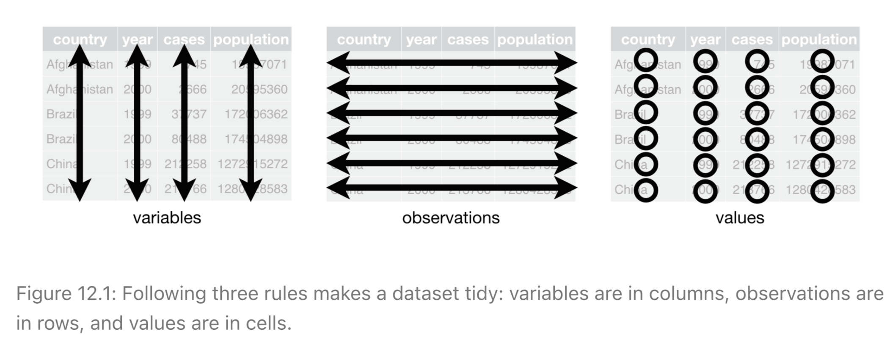

```{r packages, echo=FALSE, message=FALSE, warning=FALSE}
library(tidyverse)
library(emo)
```

# Recall ...


.pull-left[

```{r echo=FALSE, out.width="100%", fig.align="left"}
knitr::include_graphics("images/r4ds_workflow.png")
```

* **import** data (into R)
* **tidy** data
  - bring it into a consistent format that can be used for multiple purposes (each column = variable; each row = observation)
  - lets you focus on understanding the data rather than which format you need

]

.pull-right[

<br>

* **transform** data
  * e.g. focus on observations of interest (such as those from a particular location), create new variables (such as speed from distance and time), compute summary statistics
* **visualise** data
  * essential for understanding
* **model** data
  * use (statistical) models to answer your questions about the data
* **communicate** insights
]

<span style="font-variant:small-caps;">Note how you already know the basics of a number of these steps!</span>

---

# Tidy data

.pull-left[
### Characteristics of tidy data:
* Each variable has its own column
* Each observation has its own row
* Each value has its own cell
]


```{r echo=FALSE, fig.cap="figure from R4DS"}



```

---

# Different data formats

<br>

* The three data frames on the next slide show example data provided in the `tidyr` package, which is part of the `tidyverse`. 

> "all display the number of TB cases documented by the World Health Organization in Afghanistan, Brazil, and China between 1999 and 2000" 

(from `?tidyr::table1`) 

* Which of these tables is tidy?

.font80[
If you want to inspect the data yourself, you can access them via `table`, `table2` and `table3`. 
]


---

# Different data formats

.pull-left[
```{r echo=FALSE, out.width="33%"}
table1

head(table2)

```
]

.pull-right[
```{r echo=FALSE, out.width="33%"}
table3
```
]

---

# Different data formats

<br>

* If you said `table1`, you were right!

<br>

* Another possibility is for data to be spread across two data frames
* See the next slide for an example (`table4a` and `table4b` from `tidyr`)

---

# Different data formats

.pull-left[
```{r echo=FALSE, out.width="100%"}
table4a
```
]

.pull-right[
```{r echo=FALSE, out.width="100%"}
table4b
```
]

---

# Advantages to working with tidy data

<br>

1. Having one consistent format for data makes it easier to learn the tools required for analysis (which can have a certain uniformity). The `tidyverse` packages, for example, are designed to work with tidy data (who would have thought! `r emo::ji("laugh")`) 

2. It is advantageous for variables to be placed in columns because this caters to R's vectorised nature. (Most R-functions work with vectors of values.)

---

class: inverse, mline, center, middle

# Your turn!

## Complete the first part of the *tidy data* tutorial
