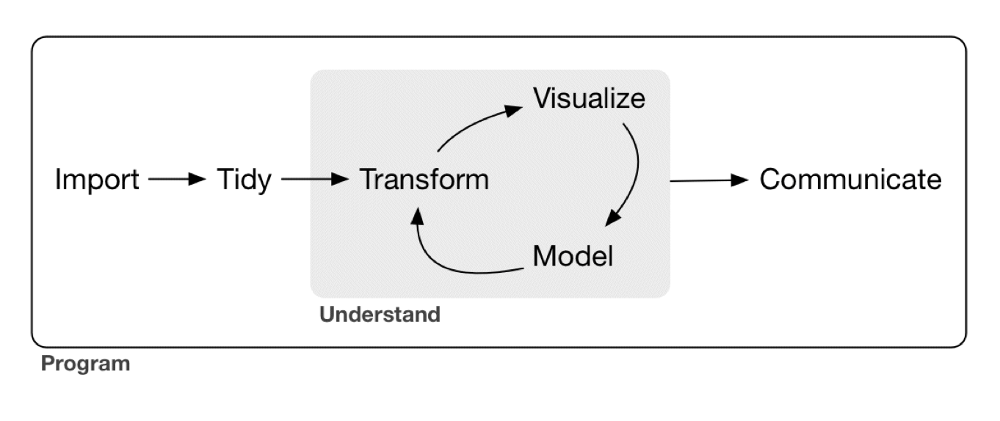
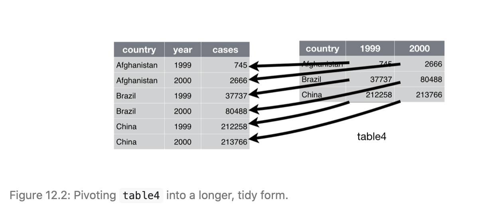
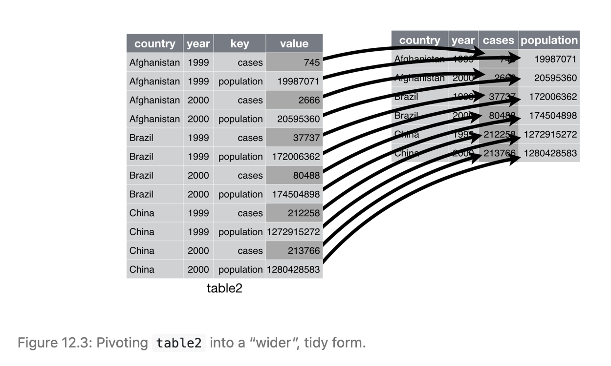

```{r packages, echo=FALSE, message=FALSE, warning=FALSE}
library(tidyverse)
library(emo)
```

# Recall ...


.pull-left[

```{r echo=FALSE, out.width="100%", fig.align="left"}

```

* **import** data (into R)
* **tidy** data
  - bring it into a consistent format that can be used for multiple purposes (each column = variable; each row = observation)
  - lets you focus on understanding the data rather than which format you need

]

.pull-right[

<br>

* **transform** data
  * e.g. focus on observations of interest (such as those from a particular location), create new variables (such as speed from distance and time), compute summary statistics
* **visualise** data
  * essential for understanding
* **model** data
  * use (statistical) models to answer your questions about the data
* **communicate** insights
]

<span style="font-variant:small-caps;">Note how you already know the basics of a number of these steps!</span>

---

# Tidy data

.pull-left[
### Characteristics of tidy data:
* Each variable has its own column
* Each observation has its own row
* Each value has its own cell
]


```{r echo=FALSE, fig.cap="figure from R4DS"}


```

---

# Different data formats

<br>

* The three data frames on the next slide show example data provided in the `tidyr` package, which is part of the `tidyverse`. 

> "all display the number of TB cases documented by the World Health Organization in Afghanistan, Brazil, and China between 1999 and 2000" 

(from `?tidyr::table1`) 

* Which of these tables is tidy?

.font80[
If you want to inspect the data yourself, you can access them via `table`, `table2` and `table3`. 
]


---

# Different data formats

.pull-left[
```{r echo=FALSE, out.width="33%"}
table1

head(table2)

```
]

.pull-right[
```{r echo=FALSE, out.width="33%"}
table3
```
]

---

# Different data formats

<br>

* If you said `table1`, you were right!

<br>

* Another possibility is for data to be spread across two data frames
* See the next slide for an example (`table4a` and `table4b` from `tidyr`)

---

# Different data formats

.pull-left[
```{r echo=FALSE, out.width="100%"}
table4a
```
]

.pull-right[
```{r echo=FALSE, out.width="100%"}
table4b
```
]

---

# Advantages to working with tidy data

<br>

1. Having one consistent format for data makes it easier to learn the tools required for analysis (which can have a certain uniformity). The `tidyverse` packages, for example, are designed to work with tidy data (who would have thought! `r emo::ji("laugh")`) 

2. It is advantageous for variables to be placed in columns because this caters to R's vectorised nature. (Most R-functions work with vectors of values.)

---

class: inverse, mline, center, middle

# Your turn!

## Complete the first part of the *tidy data* tutorial

---

class: inverse, mline, center, middle

# Dealing with untidy data

## (you will need this more often than you might think)

---

# Data are often untidy


### Common problems

1. Variables are spread across multiple columns
2. Observations are spread across multiple rows

### The solution

* functions `pivot_longer()` and `pivot_wider()` in `tidyr`!

---

# Pivot to longer

.pull-left[
**Common problem**: column names are values of a variable rather than variables

**Example**: `table4a`

```{r show_table4a, echo=FALSE}
table4a
```
]

.pull-right[
**Solution**: *pivot* these columns to new variables, rendering the dataset longer

We need:

* the columns with values as names (`1999` and `2000`)
* the name of the variable to move the column names to (`year`)
* the name of the variable to move the column values to (`cases`)

]

---

# Pivot to longer

```{r pivot_longer}

table4a %>% 
  pivot_longer(c(`1999`,`2000`), names_to = "year", values_to = "cases")

```

---

# Pivot to longer

```{r echo=FALSE, fig.cap="from R4DS"}

```

*Exercise: try doing the same thing with `table4b`!*

---

# Excursus: joining tables

We can easily join the longer versions of `table4a` and `table4b` using `left_join()` (more on joining operations later):

```{r join_example}
tidy4a <- table4a %>% 
  pivot_longer(c(`1999`, `2000`), names_to = "year", values_to = "cases")

tidy4b <- table4b %>% 
  pivot_longer(c(`1999`, `2000`), names_to = "year", values_to = "population")

left_join(tidy4a, tidy4b)

```

---

# Pivot to wider

* `pivot_wider()` is the counterpart of `pivot_longer()` which you need when observations are spread across multiple rows such as in `table2`
* here, the table needs to be made wider

```{r show_table2, echo=FALSE}
table2
```

---

# Pivot to wider

To tidy `table2` we need:

* the column to take variables from (`type`)
* the column to take values from (`count`)

```{r tidy_table2}

table2 %>% 
  pivot_wider(names_from = type, values_from = count)
```

---

# Pivot to wider

```{r echo=FALSE, fig.cap="from R4DS"}

```

---

# What's up with table3?

<br>

```{r show_table3, echo=FALSE}
table3
```

---

# Multiple variables in one column

* in `table3`, the `rate` column contains both cases and population
* to deal with this problem, we can use the `separate()` function
* it allows us to easily split a column according to a delimiting character (here, the "/")
* note how `separate` is clever enough to correctly guess the delimiting character -- it looks for a non-alphanumeric character by default (to specify it manually, use `sep = "/"`)

```{r separate_table3}
table3 %>% 
  separate(rate, into = c("cases","population"))
```

---

# Multiple variables in one column

<br>

* by default, `separate` retains the original column type (character in this case)
* we can ask it to try to convert to a more suitable type using the `convert` parameter

```{r separate_and_convert}
table3 %>% 
  separate(rate, into = c("cases","population"), convert = TRUE)
