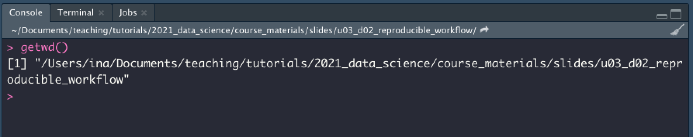
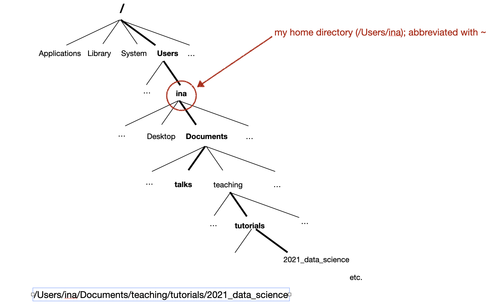
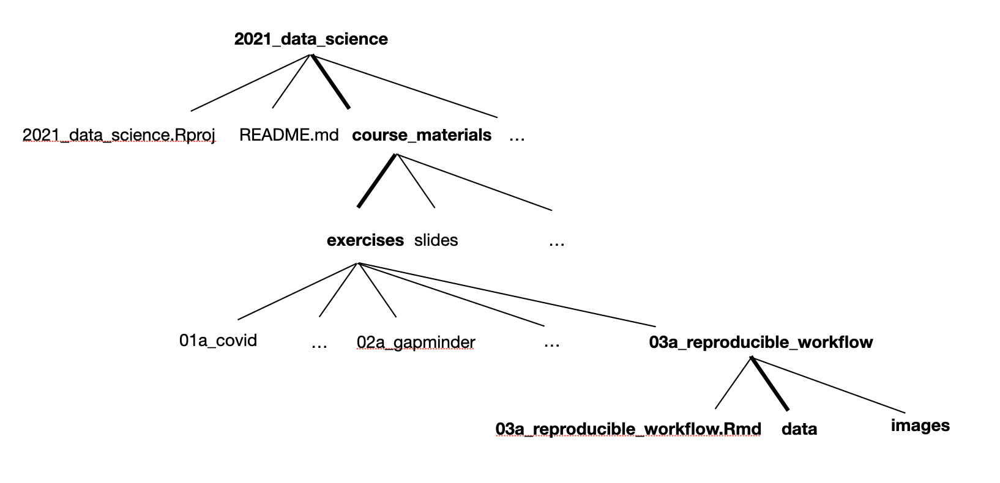
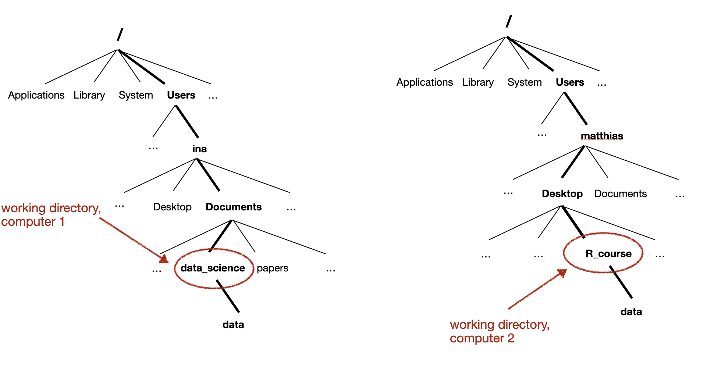

```{r packages, echo=FALSE, message=FALSE, warning=FALSE}
library(tidyverse)
library(emo)
```

class: inverse, mline, center, middle

# Directory structure, working directory and paths

---

# The working directory


<br>

The working directory in R is the directory in which R looks for any input files and where it saves any files that you ask it to save.

You can find out what it is by typing `getwd()` into the console:

It is also shown at the top of the console:

```{r echo=FALSE, out.width="85%", fig.align="right"}

```

---

# Directory structure

To get an idea of where your working directory "lives", it is helpful to have a sense of the overall directory structure, e.g. (on a Mac -- this will be a bit different on a different OS, but the basic concept is the same). A directory structure is a bit like a tree:

```{r echo=FALSE, out.width="85%", fig.align="right"}

```

---

# Zooming in ...

* As you can see, the `2021_data_science` directory ("folder") has quite a rich internal structure with further subdirectories (subfolders) to organise the files for this course.
* We will focus on the directory `03a_reproducible_workflow`, which is located under `course_materials` and `exercises`


```{r echo=FALSE, out.width="85%", fig.align="right"}

```

---

# A "path"

* ... provides instructions on how to get to a directory (or file)
* it can be either absolute, i.e. with reference to the complete directory structure
* or relative, i.e. from the perspective of a particular directory (normally: our working directory)
* paths include forward slashes (`/`) to delineate the hierarchical directory structure on Mac OS, Unix and Linux, and backward slashes (`\`) on Windows
* in R, you can work with either regardless of your OS, but forward slashes are recommended (easier)

Example: path to my `course_materials` directory, assuming that `2021_data_science` is the current working directory

* absolute: `/Users/ina/Documents/teaching/tutorials/2021_data_science/course_materials`
* relative: `course_materials`

---

# Relative paths for reproducibility

* For a reproducible analysis, use paths relative to the working directory
* A script will then run on different computers with different overall directory structures, as long as the subdirectory structure under the working directory remains the same
* e.g. `read_csv("data/input.csv")` will work regardless of where the working directory is located, as long as it contains a subdirectory `data`

```{r echo=FALSE, out.width="85%", fig.align="right"}

```

---

# Relative paths for reproducibility

## Basic workflow: 

* Place your .R (script) or .Rmd (R Markdown) file in the directory that will be your working directory for an analysis
* Open it in RStudio
* Select Session > Set Working Directory > To Source File Location
* Use relative paths

---

class: inverse, mline, center, middle

# An even better approach: use RStudio projects!

---

# RStudio projects

<br>

... provide an easy way to keep all of the files associated with an analysis (input files, analysis scripts, outputs etc.) in one place.

<br>

*Exercise: Have a go at creating an RStudio project by following the instructions in R4DS, section 8.4!*

